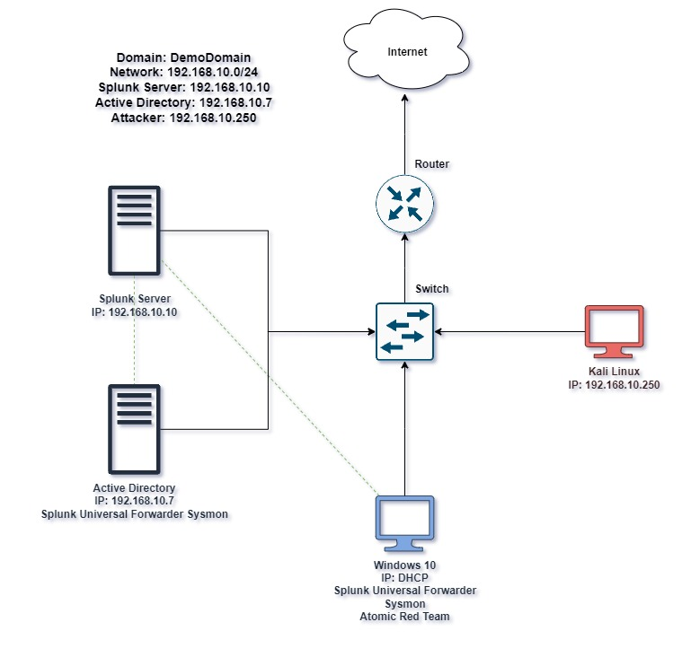

# Active Directory & Endpoint Security Home Lab

## Overview
This project documents a home lab I built to gain hands-on experience with Active Directory administration, endpoint monitoring, and basic penetration testing concepts. Using Oracle VM VirtualBox, I created a small virtualized network consisting of a **Windows Server 2022** domain controller, a **Windows 10** client, a **Kali Linux** attack machine, and an **Ubuntu Server** running Splunk.

*Ref 1. Active Directory Lab Diagram*

*Estimated completion time: 4 hours (not including time wait for downloading)*

## Objective
My goal was to move beyond theory and actually configure the systems and tools that show up constantly in networking and cybersecurity job postings: **Active Directory**, **SIEM logging**, **endpoint monitoring**, and **basic attack simulation**. I wanted to understand not just how these tools work individually, but how they connect - how a domain controller, a client machine, and a logging server all communicate on the same network.

## What I Built

- **Network setup**: Configured a NAT Network in VirtualBox (192.168.10.0/24) so all four VMs could communicate, and assigned static IPs to each machine
- **Active Directory**: Installed AD Domain Services on Windows Server, promoted it to a domain controller (demodomain.local), created organizational units (IT, HR), and joined the Windows 10 machine to the domain
- **Splunk SIEM**: Installed Splunk Enterprise on Ubuntu Server and deployed the Universal Forwarder + Sysmon on Windows machines to centralize Windows Event Logs (Security, System, Sysmon) into a searchable index
- **Attack simulation**: Used Crowbar on Kali Linux to run a brute-force RDP attack against the domain-joined Windows machine, then analyzed the resulting logs in Splunk

## Key Findings

- After the brute-force attack, I was able to identify **60 instances of Event Code 4625** (failed logon) in Splunk, all occurring within a tight time window - a clear signature of a brute-force attempt
- I also located the corresponding **Event Code 4624** (successful logon), confirming the attack eventually succeeded with one of the test passwords
- When I ran an Atomic Red Team test for local account creation (T1136.001), **no corresponding event appeared in Splunk** - which showed me a real gap in my monitoring setup. This was actually one of the most valuable parts of the lab, because it forced me to think about what *should* be logged versus what was *actually* being logged

## Skills Gained

- VM provisioning and network configuration in VirtualBox
- Active Directory Domain Services setup, OU/user management, and domain joining
- Splunk installation, index configuration, and log searching
- Sysmon configuration for enhanced endpoint visibility
- Basic offensive security testing (Crowbar, Atomic Red Team)
- Reading and interpreting Windows Security event logs
- PowerShell scripting for automation tasks

## Tools Used

VirtualBox, Windows Server 2022, Windows 10, Kali Linux, Ubuntu Server, Splunk Enterprise, Splunk Universal Forwarder, Sysmon, Crowbar, Atomic Red Team, PowerShell

## Credit

This lab was based on a walkthrough originally written by [avulman](https://github.com/avulman/active-directory-project), who in turn credited the YouTube channel **MyDFIR** for the original tutorial. I followed their structure to build and document my own version of this environment.
